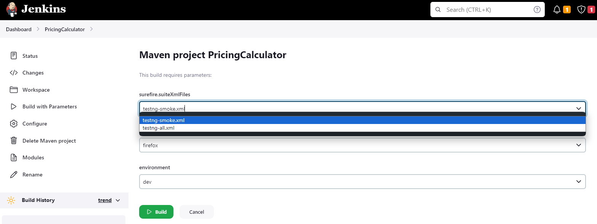

Hardcore

При выполнении задания необходимо использовать возможности Selenium WebDriver, юнит-тест фреймворка и концепцию Page Object. Автоматизировать следующий сценарий:

1. Открыть https://cloud.google.com/
2. Нажав кнопку поиска по порталу вверху страницы, ввести в поле поиска"Google Cloud Pricing Calculator"
3. Запустить поиск, нажав кнопку поиска.
4. В результатах поиска кликнуть "Google Cloud Pricing Calculator" и перейти на страницу калькулятора.
5. Активировать раздел COMPUTE ENGINE вверху страницы
6. Заполнить форму следующими данными:
    * Number of instances: 4
    * What are these instances for?: оставить пустым
    * Operating System / Software: Free: Debian, CentOS, CoreOS, Ubuntu or BYOL (Bring Your Own License)
    * Provisioning Model: Regular
    * Series : N1
    * Machine Type : n1-standard-8    (vCPUs: 8, RAM: 30 GB)
    * Выбрать Add GPUs
        * Number of GPUs: 1
        * GPU type: NVIDIA Tesla V100
    * Local SSD: 2x375 GB
    * Datacenter location: Frankfurt (europe-west3)
    * Commited usage: 1 Year
7. Нажать Add to Estimate
8. Выбрать пункт EMAIL ESTIMATE
9. В новой вкладке открыть https://yopmail.com/ или аналогичный сервис для генерации временных email'ов
10. Скопировать почтовый адрес сгенерированный в yopmail.com
11. Вернуться в калькулятор, в поле Email ввести адрес из предыдущего пункта
12. Нажать SEND EMAIL
13. Дождаться письма с рассчетом стоимости и проверить что Total Estimated Monthly Cost в письме совпадает с тем, что отображается в калькуляторе

Practical Task

Задача - построить фреймворк для автоматизации Hardcore задания из курса WebDriver.

Что должно быть в итоговом фреймворке:

1)webdrivermanager для управления коннекторам к браузерам
2)Page Object / Page Factory для абстракций страниц
3)Модель для бизнес-объектов необходимых сущностей
4)properties файлы с тестовыми данным для разных окружений (как минимум 2)
5)xml suites для smoke тестов и всех тестов
6)При падении теста должен быть сделан скриншот с датой и временем
7)Фреймворк должен иметь возможность запуска с Jenkins и параметризацией браузера, тест suite, environment. Результаты тестов должны быть на графике джобы, скриншоты должны быть заархивированны как артефакты

_______________________________________________
gitbash:
mvn -Dbrowser=chrome -Denvironment=dev -Dsurefire.suiteXmlFiles=src\\test\\resources\\testng-smoke.xml clean test

Jenkins:
